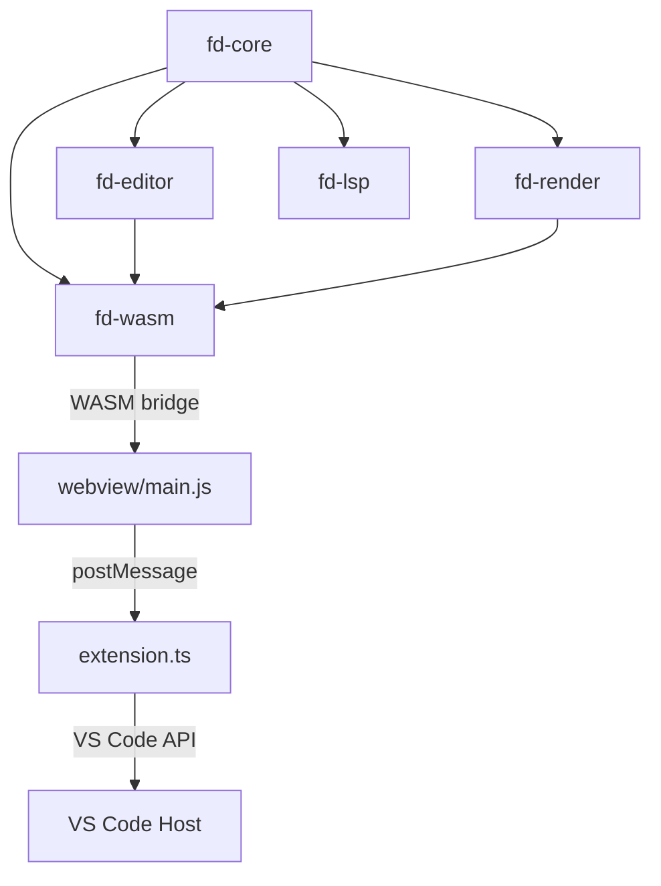
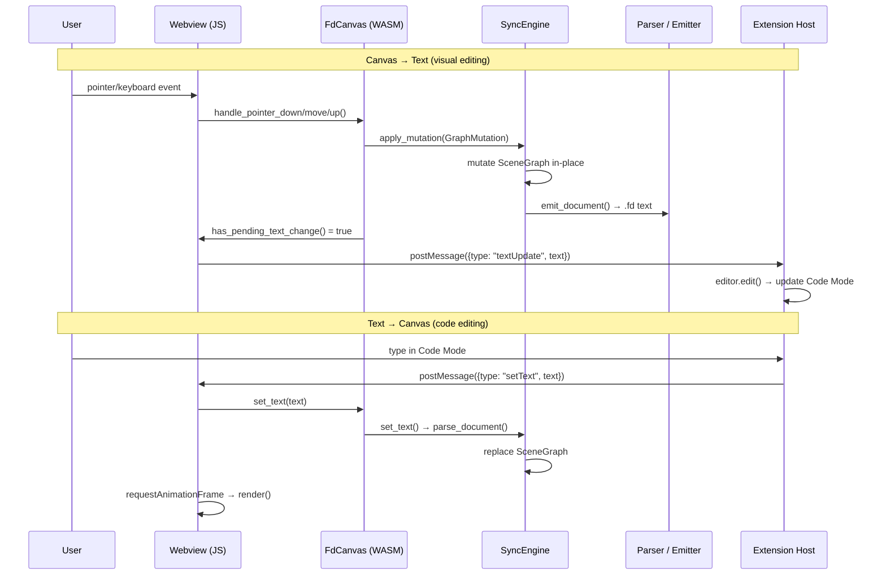

# FD Architecture

> System-level overview of Fast Draft — crate boundaries, data flow, key abstractions.

## Crate Map

```
fast-draft/
├── crates/
│   ├── fd-core/         Data model, parser, emitter, layout solver, lint, format
│   ├── fd-editor/       Tools, sync engine, undo/redo, input, shortcuts
│   ├── fd-render/       Hit testing, Canvas2D paint helpers (#[cfg(wasm)])
│   ├── fd-wasm/         WASM bridge (FdCanvas), Canvas2D renderer, SVG export
│   └── fd-lsp/          Language Server Protocol (diagnostics, formatting)
├── fd-vscode/           VS Code extension (TypeScript)
│   ├── src/extension.ts    Extension host (custom editor, commands, AI refine)
│   └── webview/main.js     Canvas webview (DOM, input handling, render loop)
├── tree-sitter-fd/      Tree-sitter grammar for syntax highlighting
├── zed-extensions/      Zed editor extension
├── examples/            Sample .fd files
└── docs/                Documentation
```

## Dependency Graph



## Data Flow

### The Bidirectional Pipeline



## Key Types

### `SceneGraph` ([model.rs](../crates/fd-core/src/model.rs))

The document is a **DAG** (Directed Acyclic Graph) stored as `petgraph::StableDiGraph<SceneNode, ()>`.

| Field      | Type                           | Purpose                               |
| ---------- | ------------------------------ | ------------------------------------- |
| `graph`    | `StableDiGraph<SceneNode, ()>` | Parent→child containment edges        |
| `root`     | `NodeIndex`                    | The invisible root node               |
| `styles`   | `HashMap<NodeId, Style>`       | Named `theme` block definitions       |
| `id_index` | `HashMap<NodeId, NodeIndex>`   | Fast `@id` → index lookup             |
| `edges`    | `Vec<Edge>`                    | Visual connections between nodes      |
| `imports`  | `Vec<Import>`                  | `import "file.fd" as ns` declarations |

### `SceneNode` ([model.rs](../crates/fd-core/src/model.rs))

A single element in the scene graph.

| Field         | Type                          | Purpose                                                        |
| ------------- | ----------------------------- | -------------------------------------------------------------- |
| `id`          | `NodeId`                      | Interned string ID (e.g. `@login_form`)                        |
| `kind`        | `NodeKind`                    | Root, Generic, Group, Frame, Rect, Ellipse, Path, Text         |
| `style`       | `Style`                       | Inline fill, stroke, font, corner, opacity, shadow, text-align |
| `use_styles`  | `SmallVec<[NodeId; 2]>`       | Named theme references (`use: base_text`)                      |
| `constraints` | `SmallVec<[Constraint; 2]>`   | CenterIn, Offset, FillParent, Position                         |
| `animations`  | `SmallVec<[AnimKeyframe; 2]>` | `:hover`, `:press`, `:enter` animations                        |
| `annotations` | `Vec<Annotation>`             | `spec { ... }` metadata                                        |
| `comments`    | `Vec<String>`                 | `# ...` lines preserved across round-trips                     |

### `SyncEngine` ([sync.rs](../crates/fd-editor/src/sync.rs))

The **single source of truth** — holds the authoritative `SceneGraph` and keeps canvas ↔ text in sync.

- `apply_mutation()` — canvas gesture → mutate graph → re-emit text
- `set_text()` — code edit → re-parse → replace graph
- `flush_to_text()` — force re-emit after batch mutations

### `FdCanvas` ([lib.rs](../crates/fd-wasm/src/lib.rs))

WASM-facing controller. All webview interaction goes through this struct:

- Holds `SyncEngine` + `CommandStack` + active `Tool`
- Exposes `handle_pointer_*`, `handle_key`, `render`, `set_text`, `get_text`
- Returns JSON for complex results (`get_selected_ids`, pointer-up tool-switch info)

### `CommandStack` ([commands.rs](../crates/fd-editor/src/commands.rs))

Reversible undo/redo stack. Every `GraphMutation` is wrapped with its computed inverse.

## Rendering Pipeline

```
render() call from JS requestAnimationFrame
  ↓
FdCanvas::render(ctx, time_ms)
  ↓
render_scene(ctx, graph, bounds, ...) [render2d.rs]
  ├── clear canvas + draw background
  ├── apply camera transform (pan/zoom)
  ├── draw grid overlay (if enabled)
  ├── for each root child (z-order):
  │     render_node(ctx, idx, bounds, ...)
  │       ├── resolve style (use: + inline + when)
  │       ├── apply opacity
  │       ├── draw shape (rect/ellipse/text/path/group/frame/generic)
  │       ├── draw annotation badge (if annotated)
  │       ├── draw selection handles (if selected)
  │       └── recurse into children
  ├── draw edges (lines/curves/arrows/labels/flow anims)
  ├── draw smart guides
  ├── draw marquee rect
  └── draw arrow preview line
```

### Canvas2D vs Vello

Currently the webview uses a **Canvas2D software renderer** (`render2d.rs`). The `fd-render` crate contains Vello/wgpu setup code (`canvas.rs`, `paint.rs`) for future GPU-accelerated rendering, but the WASM build uses Canvas2D as the MVP renderer.

## Module Responsibilities

| Module            | Responsibility                                   | Does NOT do               |
| ----------------- | ------------------------------------------------ | ------------------------- |
| `fd-core`         | Data model, parse, emit, layout, lint, format    | Rendering, input, WASM    |
| `fd-editor`       | Tools, sync, undo/redo, shortcuts, input events  | Rendering, WASM bindings  |
| `fd-render`       | Hit testing, paint setup                         | Canvas2D drawing, WASM    |
| `fd-wasm`         | WASM bridge, Canvas2D renderer, SVG export       | Parsing, layout           |
| `webview/main.js` | DOM, input capture, render loop, UI panels       | Parsing, layout, hit test |
| `extension.ts`    | VS Code API, custom editor, AI refine, text sync | Canvas rendering          |

## String Interning

All `NodeId` values are interned via the `lasso` crate ([id.rs](../crates/fd-core/src/id.rs)). Comparison is O(1) pointer equality. The interner is thread-local.

## Layout Solver

Constraints ([layout.rs](../crates/fd-core/src/layout.rs)) are resolved top-down:

1. `Position { x, y }` → parent-relative coordinates
2. `CenterIn(target)` → center within target bounds
3. `Offset { from, dx, dy }` → offset from reference node
4. `FillParent { pad }` → fill parent minus padding
5. Groups auto-size to union bounding box of children
6. Frames have declared `w/h` and optional `clip: true`
